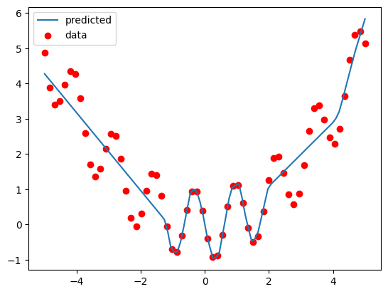

# Neural Networks In Numpy

This project contains a small automatic differentiation engine based on Numpy + some deep learning infrastructure (different layers, loss functions, optimizers). The structure (functions
and classes) roughly matches that of PyTorch.
The goal was to get a better understanding of what goes on in the background of PyTorch after ```backward``` is called.


## Usage

```
X = Tensor(np.array([
    [0, 0.0],
    [0, 1],
    [1, 0],
    [1, 1]
]))

# we use categorical cross entropy
# even though binary cross entropy would suffice
# left = 0, right = 1

y_true = Tensor(np.array([
    [1, 0],
    [0, 1],
    [0, 1],
    [1, 0]
]))

nn = Sequential(
    Linear(2, 8),
    ReLU(),
    Linear(8, 2)
)

sgd = SGD(nn.get_params(), lr=1e-4)
criterion = CELossWithLogits()

n_epochs = 10_000

for epoch_idx in range(n_epochs):

    logits = nn.forward(X)

    loss = criterion.forward(logits, y_true)

    sgd.zero_grad()

    print(f"Loss = {loss.value}")

    loss.backward()

    sgd.step()
```

## Results

Classification (Learning the XOR function):

See **learning_xor.ipynb**


Regression (Learning a 1D function):

See **regression_example.ipynb**



## What's implemented

Tensor:
- addition
- scalar multiplication
- broadcasting (repeating rows and columns)
- sum
- pow

Layers: 
- Linear
- ReLU
- Sequential

Optimizers:
- SGD

Loss functions:
- Cross Entropy with logits
- Mean Squared Error

## Resources Used

- [Derivative of Cross Entropy With Logits](https://towardsdatascience.com/derivative-of-the-softmax-function-and-the-categorical-cross-entropy-loss-ffceefc081d1)

- [Karparthy's scalar-valued autodiff engine](https://github.com/karpathy/micrograd)

- [Douglas Orr's awesome blog post](https://douglasorr.github.io/2021-11-autodiff/article.html)

- [University of Toronto Backprop Slides](https://www.cs.toronto.edu/~rgrosse/courses/csc421_2019/slides/lec04.pdf)

## Note:

To use the autodiff engine, make sure to
install the required packages with ```pip install -r requirements.txt```
